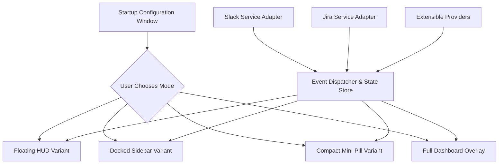

# Screen Overlay Platform Plan

================================================================================
# 1. Project Vision & Architecture Overview
================================================================================
The objective of this project is to build a lightweight, highly configurable screen overlay application in Rust. The application acts as a unified hub for team communication and issue tracking, integrating directly with platforms like Slack and Jira. 

The application launches as a standard desktop configuration window, allowing users to authenticate, tune options, and select their desired overlay presentation mode. Once launched into overlay mode, it seamlessly transitions into different graphical variants (e.g., floating HUD, docked sidebar, compact mini-pill, or transparent click-through widget) according to user preferences and screen real estate.

---

================================================================================
# 2. Functional & Non-Functional Requirements
================================================================================

### Functional Requirements
1. **Window Modes & Dynamic Switching**:
   - **Initial Window State**: Standard resizable desktop window containing settings, credentials manager, account links, and variant preview.
   - **Overlay Variants**:
     - *Floating HUD*: Small semi-transparent draggable widget showing active mentions and priority issues.
     - *Docked Sidebar*: Edge-pinned drawer displaying ticket queues and active message threads.
     - *Compact Mini-Pill*: Minimalist pill displaying unread counts and status badges with click-to-expand behavior.
     - *Transparent Click-Through*: Ambient heads-up display rendering notifications without intercepting mouse clicks.
2. **Platform Integrations**:
   - **Slack**: Channel polling/WebSocket event streaming, direct message alerts, unread mentions counter, quick-reply or reaction triggers.
   - **Jira**: JQL query evaluation, assigned issue lists, status transitions, sprint burndown highlights.
   - **Extensibility**: Pluggable provider architecture permitting rapid addition of platforms (e.g., GitHub, Discord, Linear).
3. **Configuration & Customization System**:
   - Comprehensive settings schema: display variant, screen alignment, window opacity, refresh intervals, hotkeys, theme palettes, and platform filters.
   - Secure token storage utilizing system keyrings or encrypted local storage.

### Non-Functional Requirements
- **Low Resource Utilization**: Minimal CPU and memory consumption while idle in the background.
- **High Responsiveness**: Asynchronous network I/O isolated from the UI rendering thread.
- **Convention Alignment**: Strict adherence to repository coding standards (PascalCase units, camelCase runtime entities, CAPITALIZED constants, section partitioning).

---

================================================================================
# 3. Component Architecture & Target File Structure
================================================================================

When implementation begins, the codebase will be partitioned into distinct conceptual units.

### Manifests & Configurations
- [Cargo.toml](file:///mnt/c/Users/andyt/VSC/Fixture/Cargo.toml)
  - Dependencies: Asynchronous runtime (`tokio`), HTTP client (`reqwest`), Serialization (`serde`, `serde_json`), Desktop windowing/rendering framework, Secure storage (`keyring`), Global hotkey handling.

### Future Source Code Units
- `src/Types/`: Domain models and data structures.
  - `OverlayVariant.rs`: Enumeration of overlay display modes and transition properties.
  - `PlatformEvent.rs`: Normalized event types across Slack, Jira, and third-party services.
  - `Configuration.rs`: Settings schema and default values.
- `src/Config/`: Configuration engine.
  - `ConfigManager.rs`: Loading, validating, saving, and hot-reloading user settings.
  - `CredentialStore.rs`: Secure storage and retrieval of API tokens.
- `src/Overlay/`: Display and window management.
  - `WindowManager.rs`: Window creation, mode transitions, transparency, always-on-top flags, click-through toggles.
  - `VariantController.rs`: Coordinates geometry, snapping, and layout rendering for each variant.
- `src/Platforms/`: External service connectors.
  - `PlatformAdapter.rs`: Trait definition specifying authentication, event polling, and outbound action interfaces.
  - `SlackAdapter.rs`: Slack API and WebSocket event listener.
  - `JiraAdapter.rs`: Jira REST API client and issue tracker.
- `src/Services/`: Core business logic and background workers.
  - `EventDispatcher.rs`: Asynchronous message broker delivering updates from platform adapters to the UI state.
  - `NotificationEngine.rs`: Filtering, deduplication, and prioritization of alerts.

---

================================================================================
# 4. Phased Implementation Roadmap
================================================================================

### Phase 1: Dependency Formulation & Domain Modeling
- Define required crates in [Cargo.toml](file:///mnt/c/Users/andyt/VSC/Fixture/Cargo.toml).
- Construct domain types (`OverlayVariant`, `PlatformEvent`, `Configuration`) with serialization support.

### Phase 2: Configuration & Credentials Management
- Implement configuration persistence with default fallback values.
- Implement token storage abstractions for Slack tokens and Jira personal access tokens (PAT).

### Phase 3: Desktop Windowing & Overlay Variant Controller
- Set up the main application window and rendering surface.
- Implement window transformation logic to morph between the initial configuration window and selected overlay variants.
- Enable window flags: frameless, transparent, always-on-top, and coordinate snapping.

### Phase 4: Platform Connector Layer (Slack & Jira)
- Implement asynchronous HTTP and WebSocket polling routines.
- Map platform-specific payloads into normalized `PlatformEvent` entities.
- Feed normalized events into the centralized `EventDispatcher`.

### Phase 5: Overlay UI & Settings Interface
- Build configuration UI controls for accounts, appearance, hotkeys, and variant switching.
- Build overlay rendering components for the HUD, Sidebar, and Mini-Pill variants.
- Connect UI reactivity to live event streams.

### Phase X: Styling and Appearance
- Utilize the following SVG libraries 
  - https://allsvgicons.com/pack/arcticons/
  - https://allsvgicons.com/collections/animated/
- Icon Specifications:
  - **Existing Assets** (available in [`src/assets/icons/`](file:///mnt/c/Users/andyt/VSC/Fixture/src/assets/icons)):
    - Window Controls: `Close.svg`, `Minimize.svg`, `Maximize.svg`
    - Layout Switcher: `Layout.svg`
    - Theme / Dark Mode: `Moon.svg`
    - Power / Quit: `Power.svg`
  - **Status Indicator**:
    - Handled via dynamic dot indicator with color-coded feedback (no static SVG required).
  - **Additional Settings Screen Icons** (to append from external libraries):
    - General / Settings: `arcticons:settings` (Animated alternative: `line-md:cog`)
    - Slack Integration: `arcticons:slack`
    - Jira Integration: `arcticons:jira`
    - Extensible Providers: `arcticons:github`, `arcticons:discord`
    - Notifications & Sound: `line-md:bell` (Alternative: `arcticons:notifications`)
    - Account & Keyring Storage: `line-md:account`, `line-md:key`
    - Hotkeys & Shortcuts: `arcticons:keyboard`
    - Variant Layout Previews: `undefined`
- The color palette must also be configured correctly for our application. 
  - Light Mode
<palette>
  <color name="Blue Slate" hex="5d737e" r="93" g="115" b="126" />
  <color name="Tropical Teal" hex="64b6ac" r="100" g="182" b="172" />
  <color name="Icy Aqua" hex="c0fdfb" r="192" g="253" b="251" />
  <color name="Frozen Water" hex="daffef" r="218" g="255" b="239" />
  <color name="Porcelain" hex="fcfffd" r="252" g="255" b="253" />
</palette>
  - Dark Mode
<palette>
  <color name="Midnight Abyss" hex="0d1317" r="13" g="19" b="23" />
  <color name="Dark Slate" hex="1b242a" r="27" g="36" b="42" />
  <color name="Blue Slate" hex="5d737e" r="93" g="115" b="126" />
  <color name="Tropical Teal" hex="64b6ac" r="100" g="182" b="172" />
  <color name="Icy Aqua" hex="c0fdfb" r="192" g="253" b="251" />
</palette>